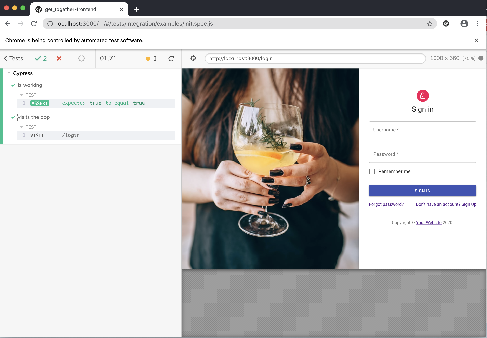
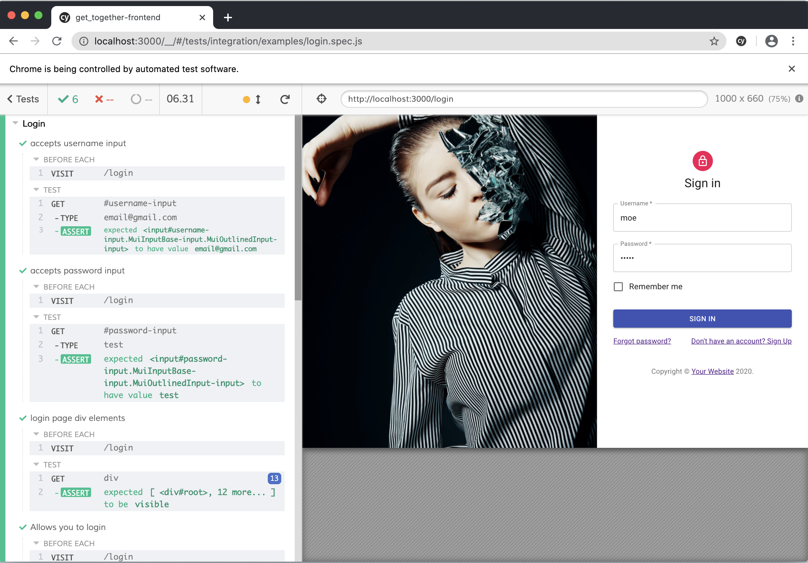
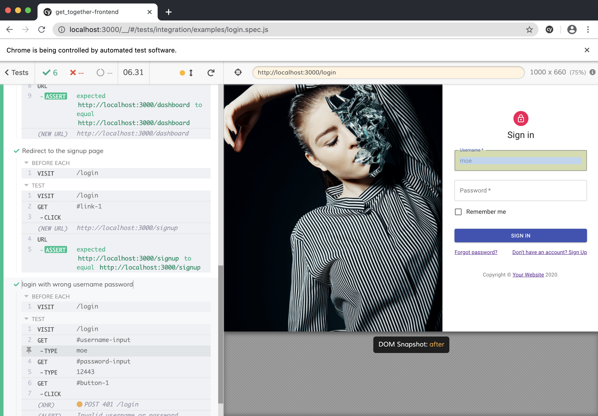
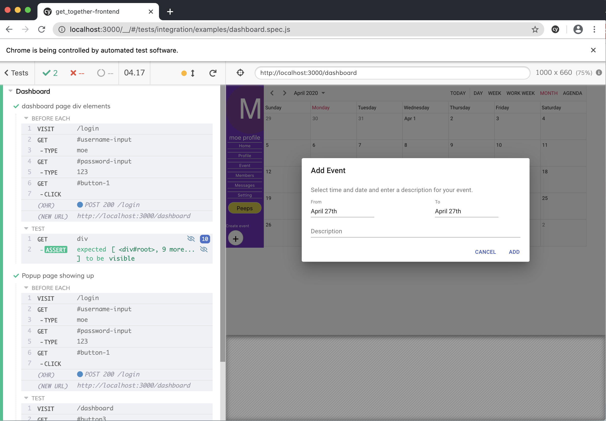

# spring2020-cs160-team-jabberwocky

## How to run front-end:

First step is:

```
git clone https://github.com/sumaiyyab/spring2020-cs160-team-jabberwocky.git
```

Then cd into the root folder and find front-end folder:

```
cd spring2020-cs160-team-jabberwocky
cd get_together-frontend
```

Before running the application, make sure to install packages:

```
npm install
```

then run the application: 

```
npm start
```

The application is hosted on localhost:3000 and the landing page is /login. 

 ## Cypress

### What is this?

Cypress comes packaged as an `npm` module, which is all you need to get started.

After installing you'll be able to:

- Open Cypress from the CLI
- Run Cypress from the CLI
- `require` Cypress as a module

### How to run the automated test cases

The test cases are written for front-end application. After installing the Cypress package:

```
cd get_together-frontend/
```

Then open two different terminal. In one run the application: 

```
npm start
```

The other terminal, run cypress: 
```
npm run cypress
```

The automated test cases should run. Here are some of the screenshots:

### Screenshots





## To locally develop backend

1. git clone repo and cd into backend folder: /spring2020-cs160-team-jabberwocky/getTogether
2. Install Project Lombok to your IDE of choice. We recommend Spring Tool Suite due to its integration of Spring Boot functionality
3. Import Java files as Maven project using the pom.xml
4. You can now develop and run the code locally on http://localhost:8080 using curl commands or the Swagger UI at http://localhost:8080/swagger-ui.html
3. 
